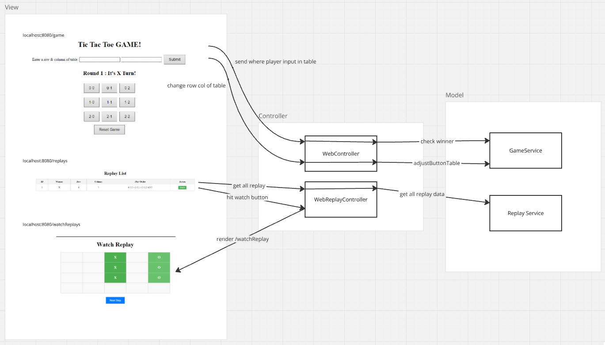

# Spring-Boot-Tic-Tac-Toe-game
## Requirements
- intellij IDEA
- JAVA 21

## Installation Guide
1. Clone or Download this repository
2. Open project with IntelliJ iDE
3. From File Explorer open XogameApplication <br />


4. Hit the run button <br />


5. If anything is fine you will get this message "Completed initialization" <br />


6. If you cannot run, IDE might tell you to select the JAVA SDK <br />


8. I recommend using JAVA 21 because this project was built on JAVA 21 <br />


## Web Page
- open in any browser you prefer
- localhost:8080/game
- for play tic tac toe <br />


- localhost:8080/replays
- for replay list that you have played and you can watch the replay from this page <br />


- localhost:8080/watchReplay
- this page will show after you hit watch button in replays page <br />


## Design


## Algorithm
I use mine tic-tac-toe algorithm I code it by myself
and all winner check I use recursive because I think it uses less code and more readability
### to check horizontal and vertical win
- I use `checkWinnerHorizontal()`
- That can check both horizontal and vertical because we can transpose the game table

### to check diagonal win
- I use `checkWinnerDiagonalLeftToRight()` and `checkWinnerDiagonalRightToLeft()`
- the function do as it name but when use these function need to implement it 2 times
- because tic-tac-toe table `row > column` or `column > rol` the traversal of Diagonal checker will different (traversal by row or by column)


```
public String checkWinner(){
    if (buttonTable.isEmpty()){
        return null;
    }

    // Horizontal and Diagonal win
    for (int i = 0; i < row; i++) {
        String winner = checkWinnerHorizontal(buttonTable.get(i), 1, col);

        // traverse by row
        if (winner == null && i <= row - col){
            winner = checkWinnerDiagonalLeftToRight(i, 0, i, 0, col);
        }
        // traverse by row
        if (winner == null && i <= row - col){
            winner = checkWinnerDiagonalRightToLeft(i, col - 1, i, col - 1, row);
        }

        if (winner != null){
            return winner;
        }
    }

    // Diagonal win
    for (int i = 0; i < col; i++) {
        // traverse by column
        if (i <= col - row){
            String winner = checkWinnerDiagonalLeftToRight(0, i, 0, i, row + i);
            if (winner != null){
                return winner;
            }
        }
        // traverse by column
        if (i >= row - 1){
            String winner = checkWinnerDiagonalRightToLeft(0, i, 0, i, row);
            if (winner != null){
                return winner;
            }
        }
    }

    // Vertical win
    List<List<String>> transpose = Util.transpose(buttonTable);
    int t_row = transpose.size();
    int t_col = transpose.getFirst().size();
    for (int i = 0; i < t_row; i++) {
        String winner = checkWinnerHorizontal(transpose.get(i), 1, t_col);

        if (winner != null){
            return winner;
        }
    }

    for (int i = 0; i < row; i++) {
        for (int j = 0; j < col; j++) {
            if (buttonTable.get(i).get(j).contains(buttonEnum.getCell_separator())){
                return null;
            }
        }
    }

    return "DRAW";
}
```

```
private String checkWinnerHorizontal(List<String> buttonTable1D, int j, int col){
    if(buttonTable1D.get(j).equalsIgnoreCase(buttonTable1D.getFirst())){
        if (j == col - 1){
            return buttonTable1D.getFirst();
        }
        return checkWinnerHorizontal(buttonTable1D, j + 1, col);
    }else{
        return null;
    }
}
```

```
private String checkWinnerDiagonalLeftToRight(int i, int j, int init_i, int init_j, int bound){
    if (buttonTable.get(i).get(j).equalsIgnoreCase(buttonTable.get(init_i).get(init_j))){
        if (j == bound - 1){
            return buttonTable.get(init_i).get(init_j);
        }
        return checkWinnerDiagonalLeftToRight(i + 1, j + 1,init_i, init_j, bound);
    }else{
        return null;
    }
}
```

```
private String checkWinnerDiagonalRightToLeft(int i, int j, int init_i, int init_j, int row){
    if (buttonTable.get(i).get(j).equalsIgnoreCase(buttonTable.get(init_i).get(init_j))){
        if (j == 0 || j == init_j - (row - 1)){ // j == 0 for fixed row case
            return buttonTable.get(init_i).get(init_j);
        }
        return checkWinnerDiagonalRightToLeft(i + 1, j - 1,init_i, init_j, row);
    }else{
        return null;
    }
}
```
